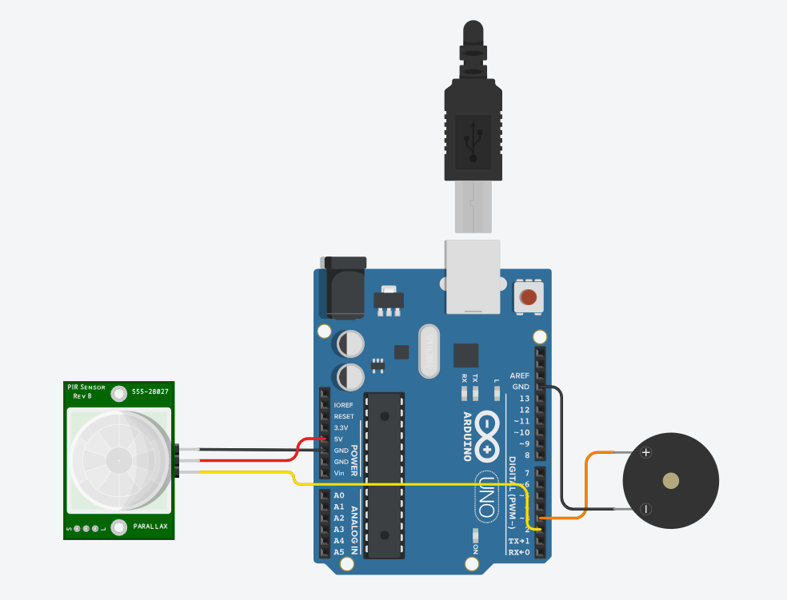

# Monitoramento do Paciente

**Descrição:** Nesse tutorial, vamos aprender a como fazer um monitoramento de pacientes, utilizando o Arduino UNO, um sensor PIR e um Buzzer.

---

## Índice

1. [Introdução](#introdução)
2. [Requisitos](#requisitos)
3. [Configuração do Ambiente](#configuração-do-ambiente)
4. [Montagem do Circuito](#montagem-do-circuito)
5. [Programação](#programação)
6. [Teste e Validação](#teste-e-validação)
7. [Expansões e Melhorias](#expansões-e-melhorias)
8. [Referências](#referências)

---

## Introdução

Esse projeto serviria para monitorar e garantir que os pacientes não ficarão fora de seus lugares ou saírão de suas camas, sem a devida autorização, evitando que acidentes aconteçam.

---

## Requisitos

### Hardware

- **Placa**: Arduino UNO.
- **Sensores**: Sensor PIR.
- **Atuadores**: Buzzer.
- **Outros componentes**: Cabos de ligação, Cabo USB

### Software

- **Linguagens**: C/C++ para Arduino.
- **IDE**: Arduino IDE, Tinkercad.
- **Bibliotecas**: Nenhuma biblioteca adicional é necessária.

---

## Configuração do Ambiente

### Passo 1: Instalação do Software

- **Arduino IDE**: Por meio do link (https://www.arduino.cc/en/software), é possível fazer o download do software que será utilizado para comunicação direta com o Arduino.

### Passo 2: Configuração das Placas

- **Arduino UNO**: Passos para configurar a placa e selecionar a porta correta na IDE.

• Conecte o Arduino UNO no computador via cabo usb;
• Clique em:
  "Select Board", na parte superior da tela.
  
  
• Selecione "Arduino UNO".

## Montagem do Circuito
• O circuito é bem simples de ser montado, tendo poucas portas a serem ajeitadas.


• Pinagem:
  **Sensor PIR:** Da direita para a esquerda, será colocado a saída de energia, ou gnd (terra - preto); no pino do meio o de energia, entrada de 5v (vermelho); e, por último, o de sinal e recebimento de informações (amarelo) na entrada 2.
  **Buzzer:** A perna positiva (esquerda) receberá o sinal vindo da placa, no caminho 3. A perna negativa (direita) irá ser a saída de energia (gnd).

## Programação

### Passo 1: Configuração dos Sensores e Atuadores
• Definição dos pinos, entrada e saída de inforamações
```cpp
// Setagem de pinos
int pirPin = 2;
int pirState = LOW;
int entPin = 0;

// Setagem de entrada e saída
void setup() {
  pinMode(pirPin, INPUT);
  pinMode(3, OUTPUT);
  Serial.begin(9600);
}
```

### Passo 2: Processamento e Lógica de Alerta

• Lógica da programação
```cpp
void loop() {
  entPin = digitalRead(pirPin);

// Caso movimento seja detectado, irá mandar um sinal posivito para a placa, junto de uma mensagem positiva, e para o buzzer, acionando seu som.
  if (entPin == HIGH) {
    if (pirState == LOW) {
      Serial.println("Movimento Detectado!");
      digitalWrite(3, HIGH);
      pirState = HIGH;
    }

// Caso não haja, irá informar que não há movimento e cessará o som do buzzer.
  } else {
    if (pirState == HIGH) {
      Serial.println("Movimento Cessado!");
      digitalWrite(3, LOW);
      pirState = LOW;
    }
  }

  delay(1);
}
```

## Teste e Validação:

1. **Testando Sensores**: O sensor PIR recebe certinho os movimentos.
2. **Validação dos Atuadores**: Quando o movimento é recebido, o buzzer ativa logo em seguida.
3. **Monitoramento em Tempo Real**: Em testes, tudo demonstrou estar em pleno funcionamento

## Expansões e Melhorias

Sugestões para melhorar o projeto:

- Adicionar comunicação Wi-Fi para enviar dados para um computador ou para pulseiras de enfermeiros.

## Referências

• https://www.tinkercad.com/things/8GgoHN5QYvV-atividade-1-maloca
• https://www.arduino.cc/en/software